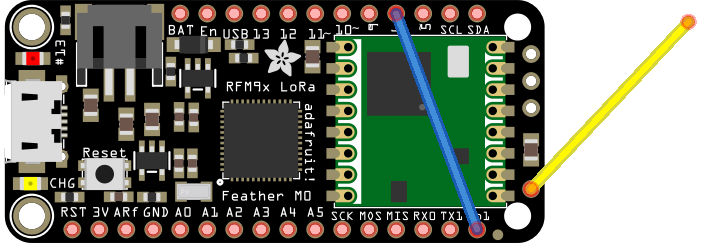
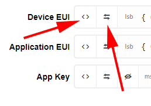
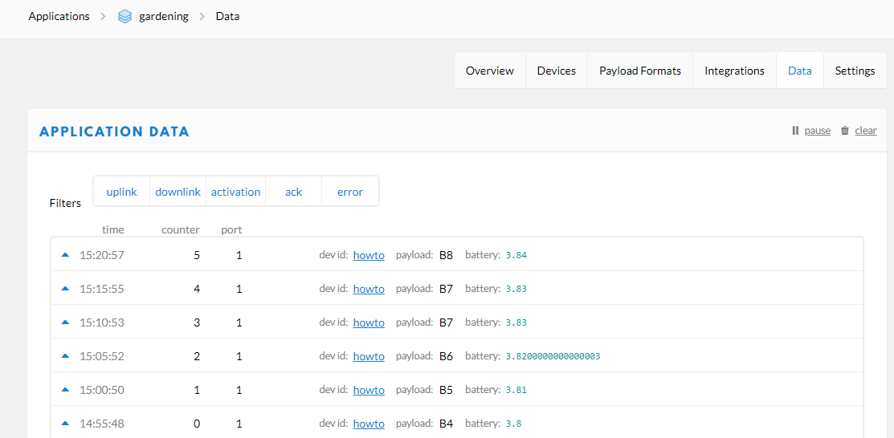

# Adafruit Feather M0 LoRa on The Things Network

This tutorial describes how to setup the [Adafruit Feather M0 with RFM95 LoRa Radio](https://www.adafruit.com/product/3178) for [The Things Network](https://www.thethingsnetwork.org/) and transmit the battery voltage encoded to reduce the duty cycle.

## Wiring

To work with The Things Network, a wire has to be soldered from DI01 to D6 (blue wire):



Adafruit [recommends](https://learn.adafruit.com/adafruit-feather-m0-radio-with-lora-radio-module/antenna-options) to solder an antenna with 8.2 cm length (for 868 MHz) to the antenna pin (yellow wire).

## How to setup up a working development enviroment for the Feather M0 LoRa

Setup the Arduino IDE with the necessary libraries: Follow the [tutorial](https://learn.adafruit.com/adafruit-feather-m0-radio-with-lora-radio-module/overview) on Adafruit, or if your Arduino IDE (or VS Code with Arduino integration) is already setup, do:

1.  Add `https://adafruit.github.io/arduino-board-index/package_adafruit_index.json` to your Additional Boards Manager URLs
2.  Install: `Arduino SAMD Boards` in the Boards Manager
3.  Install: `Adafruit SAMD` in the Boards Manager
4.  Select the Board Type `Feather M0`
5.  Under Linux/Ubuntu, you might have to add your user to the dialout group: `sudo usermod -a -G dialout $USER`, and make sure the changes are applied.
6.  Select the port for your feather.

Clone this Arduino Sketch: `git clone https://github.com/werktag/m0-lorawan-ttn`

Clone the lmic library adjusted for the Feather M0 LoRa into your Arduino library folder: `git clone https://github.com/huebe/arduino-lmic` (The Arduino library folder is usually be found in `Documents\Arduino\libraries` in Windows, and `~/Arduino/libraries` in Linux)

The changes to the original lmic library are a slower SPI speed and the correct radio settings.

Now it's time to verify the sketch and upload it onto your feather.
If the Sketch can't be uploaded, a double click on the reset button of the feather might help. The blinking red LED indicates that your feather is in bootloader state and ready to be programmed.

## Getting the credentials form The Things Network

If you don't have login for The Things Network (TTN), create one.

To adjust the TTN Credentials in the Sketch:

   * In the [TTN Console](https://console.thethingsnetwork.org/), create an application.
   * Add a device to the application. Give it a Device ID of you choice, click the "Generate" button for Device EUI, leave App Key empty and press "Register".
   * In the Device Overview, copy the Application EUI to the APPEUI variable in the Sketch in the C-Style lsb format.
   * In the Device Overview, copy the Device EUI to the DEVEUI variable in the Sketch in the C-Style lsb format.
   * In the Device Overview, copy the App Key to the APPKEY variable in the Sketch in the C-Style msb format.
  
  

## Retrieving data on The Things Network

As you might notice in the Sketch, the battery voltage gets squeezed into one byte:

```c
    // Payload format Bytes: [(Bat-Voltage - 2) * 100]
    double measuredvbat = analogRead(VBATPIN);
    measuredvbat *= 2;    // we divided by 2, so multiply back
    measuredvbat *= 3.3;  // Multiply by 3.3V, our reference voltage
    measuredvbat /= 1024; // convert to voltage
    measuredvbat -= 2; // offset by -2
    measuredvbat *= 100; //make it centi volts
    vals[0] = (unsigned char)measuredvbat; //we're unsigned
```

As duty cycle is everything when transmitting data over LoRaWan, it's recommended to compress your data as much as possible. To make the data handling easier on the server, TTN provides a decoder functionality to decode the value into the better readable JSON format.
 In the [TTN Console](https://console.thethingsnetwork.org/) -> Application -> [your application] -> Payload Formats, add the following decoder function in the [decoder] tab:

```javascript
function Decoder(b, port) {
  
  var bat = b[0] / 100 + 2;
  
  return {
    battery: bat
  }
}
```

The decoded battery value should now appear in the Application Data Tab:


(as you might notice, the battery is charging ;) )

That's it, enjoy LoRaWan with your feather!

Enjoyed this article? Head over to [Werktag Blog](https://blog.werktag.io) for more articles.